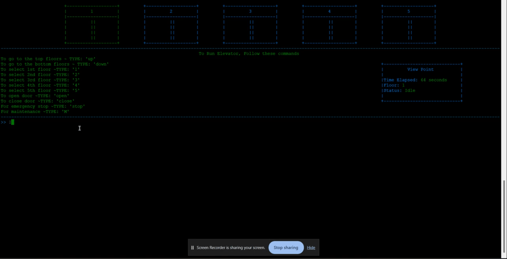
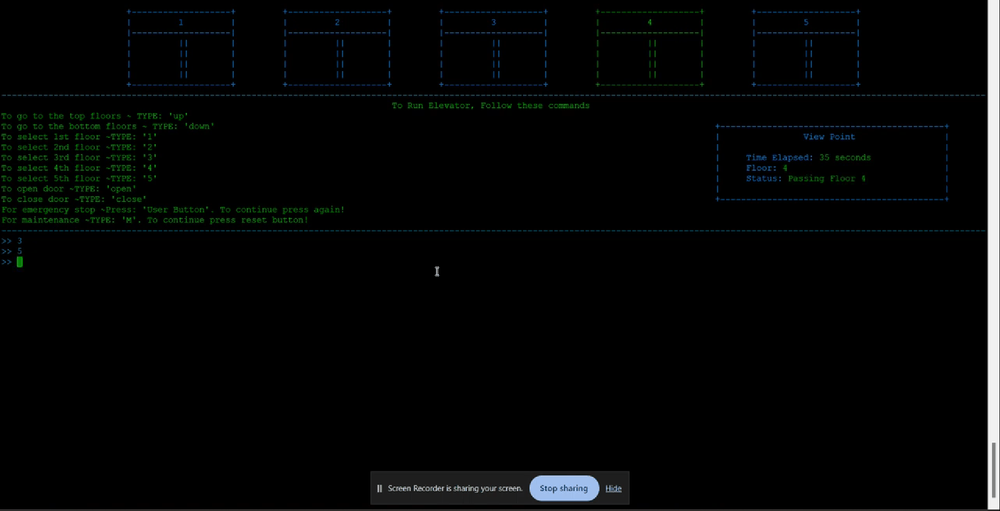

    

 
  

    

 

    <a href="https://amanpadda.uk.to">Final Product</a>

 
 

    

<h3 align = "center">Languages</h3>

  
  

<h2></h2>

<h3 align="center">Development Tools & Environments</h3>

  
  
  

<h2></h2>

<h3 align="center">Hardware and Microcontroller Boards</h3>

  

 

 

    

 

    
    

    
    

 

 

    

 

- <a href = "#">Description</a>

- <a href = "#">Milestone</a>